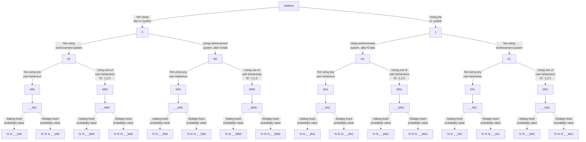

# Rust Modern Trial Simulator
 Appended version of earlier trial simulator @ https://github.com/MrMisc/RustyTrialSimulator. Experimental. Contains probability values that increase as part of a modern pity system commonly found in Modern MMOs

Activating this programme by the way, is done by typing ``py DataPointEntry.py`` in cmd prompt within the directory.

The following GUI pops up.

## M series | Methods

In addition to the logic previously, there is now an additional set of methods that range between 100.000 to 10.000.000+++

The meaning behind these methods are as follows, starting from the left.

The first digit represents whether we use the old pity system - 2 consecutive fails lead to a success. 0 means there is none, 1 means there is. A binary switch, in other words.

The second digit indicates the reinforcement system. The number indicates as before, how many successive successes are required to earn a free success. 

Third digit represents the method class:1,2,3 and 4+ for no method. These are the user behaviours that made up the building block of the original simulator.

The 4th and 5th digit are meant to represent the number of failures required to occur at a fixed level (*) for the version 2 of the pity system to be invoked. If you For eg, in 1003100, you are on method class 1, as previously illustrated, and it takes '03' fails in a row for the pity system to take effect.

Finally, there are either 1,2 or above 3 remaining digits that make up the method number. If there are 1-2 digits left, this means that this is the % probability that is ADDED to the trial that the seed is stuck on attempting. This probability for this trial is continuously increased, free to reach 100%. 

However, if there are more than 2 digits, this tells the code that we are to multiply the trial's probability with the % amount provided.

## Logical guide

Suppose that you are wondering what method to insert if you know you are using the second version of the pity system (pity v2 system). Let's go through the process.

Please note that it is equally valid to simply give the thousandth digit for the method, any digit OTHER than {1,2,3} to avoid using any user behaviours (method classes) such as 4,5,6 etc. 0 was simply an indicator/example used in this presentation.

% signs reflect the **probability value** of the associated probability/factor added to or multiplied to the original probability of the trial. The reason for this design is because we are exploiting the redundancy of triple or above digit probability values as percentages.  Asking the code to add a probability of 1.2 for instance (by using a method as the following 120_ _ & & &) instantly brings the probability of the trial in question, above 1.0. Assuming that you are equally not attempting to run trivial probability values -namely 0.0. You are never going to need to provide something like 100 _ _ & & & as a method. 99 _ _ & & & as a method would suffice for low enough probability values.

### Quick examples

So for eg, if you choose 1003100 as your method, this means that for any fixed trial, if the seed fails more than 3 times, +10% is applied to the trial in question until success is achieved.

In comparison, 11003100, is meant to indicate that the same trial at which this seed has failed, will have its probability multiplied by 1.1 continuously, until success.

### Case Scenario 1

Let us compare 2 trial systems with the same probability and monetary scheme - 0.05,0.005*,0.005*, where each trial costs say, 1 dollar.

Both use NO scheme except for pity system v2. Everything else is off. No user behaviour is considered either.

**Scheme 1**: A probability of 0.05 is added everytime the seed fails above 5 consecutive times.

**Scheme 2**: The probability of the trial is multiplied by 3 everytime the seed fails 3 consecutive times.

This results in the methods being 

505400 for simulation 1, and 30003400 for simulation 2. The 4 in both can be replaced with anything else as long as it is not within the set {1,2,3}.

Let's run this comparison between the 2 for 100 000 trials.

### Success rate plot

### Money distribution plot

Execution time took 15.786s or so.

### Case Scenario 2

Let us consider something slightly more interesting. Let us say, that we wished to, very informally, try to make a comparison between the significance between pity system versions 1 and 2. Just to recollect, version 1 of the pity system is whereby the seed is provided an automatic success after 2 consecutively distinct failures. Version 2 is one where the probability of a fixed trial is increased for every consecutive fail after a specific number of failures on that trial.

Consider the following,

**Scheme 1**: Prob = {0.05,0.3,0.005*}, Pity system v1 + Pity system v2 where fixed trial probability is multiplied by 3 for every consecutive failure after 3 repeats.

**Scheme 2**: Prob = {0.05,0.005*,0.005*}, No pity system v1, but same pity system v2 parameters.

Both schemes have the same pricing, {1.0,1.0,1.0}. Which simulation would fair better?

### Success rate plot

### Money distribution plot

There is not a clear, decisive winner if one were being particular about it. However, on the user side, it is far more beneficial for them to have a pity system version 2, WITHOUT any levels that penalise a loss with a level fall, as is evident by the spread of the 1st simulation, leading a greater percentage of seeds to much higher costs.
